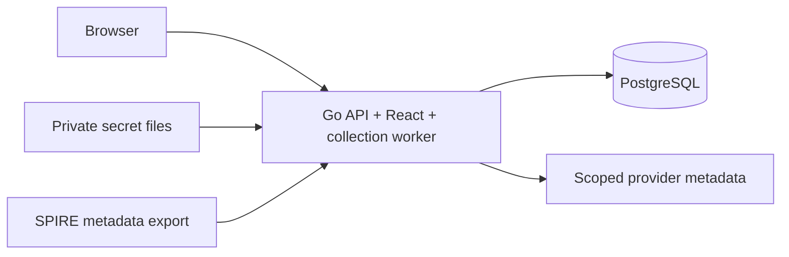
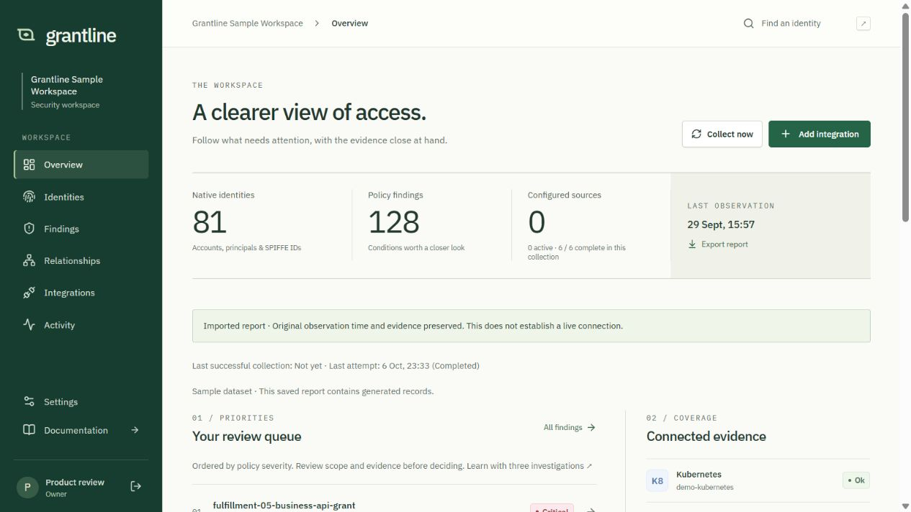
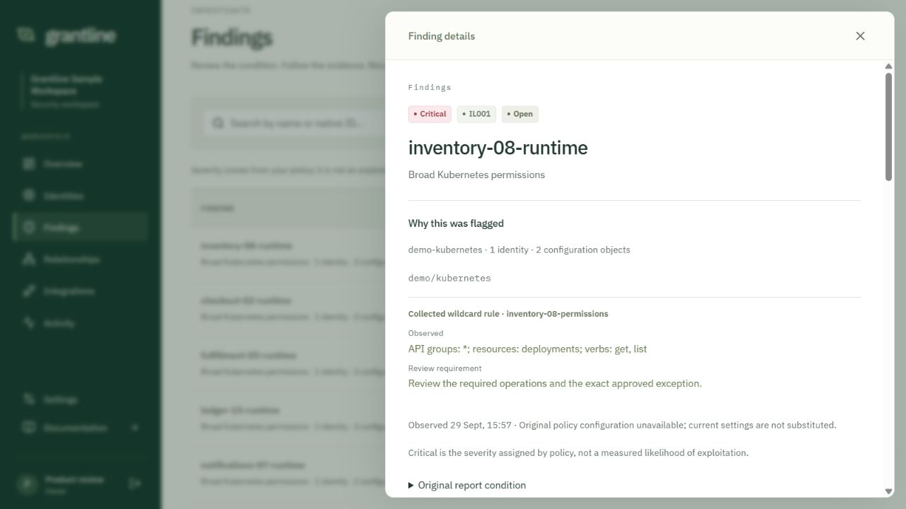

# Grantline


Open-source, evidence-first security for discovering and analyzing non-human
identities across software delivery and workload environments.

**Early access: v0.1.0-rc.5.**
See the [implementation and acceptance ledger](docs/PRODUCTION_WORK.md) for verified
capabilities and remaining gates. Development builds are not labeled production ready.



Kubernetes · Vault · Jenkins · Microsoft Entra · GitHub · SPIRE exports.
[Supported scope](docs/supported-sources.md) · [Permissions](docs/permissions.md) ·
[Architecture](docs/architecture.md) · [Apache-2.0](LICENSE)

Mapped to selected OWASP Non-Human Identities Top 10 risks:
[excessive privileges, credential lifetime and environment isolation](docs/owasp-nhi-mapping.md).
This is not OWASP certification or full NHI coverage.

## Start with Docker

Download the [installation ZIP](https://github.com/grantlinehq/grantline/releases/download/v0.1.0-rc.5/grantline-install-0.1.0-rc.5.zip)
or [TAR package](https://github.com/grantlinehq/grantline/releases/download/v0.1.0-rc.5/grantline-install-0.1.0-rc.5.tar.gz),
extract it into a new directory, then run:

```sh
docker compose up -d --wait
```

Open http://127.0.0.1:8080. Read the setup token in your terminal:

```sh
docker compose exec app cat /var/lib/grantline/secrets/setup-token
```

Create the first Owner and enroll an authenticator. Invite your team and configure
connections through the UI. Go, Node and a source build are not required. The
package pins the application image by digest and includes the installation guides.

Prerequisites: Docker with Compose, Linux containers, a free loopback port 8080
and network access to pull the images. Budget 4 vCPU / 8 GB for the reference workload.
Keep generated secret volumes private; do not use `down -v` to stop a real workspace.

[Docker and HTTPS guide](docs/guide/install/docker.md) ·
[Kubernetes and Helm guide](docs/guide/install/kubernetes.md) ·
[Product documentation](docs/guide/index.md)

Container: `ghcr.io/grantlinehq/grantline:0.1.0-rc.5` (`linux/amd64`, `linux/arm64`).
Helm chart: `oci://ghcr.io/grantlinehq/charts/grantline --version 0.1.0-rc.5`.
The [release page](https://github.com/grantlinehq/grantline/releases/tag/v0.1.0-rc.5)
includes checksums, signatures and the source archive.

To build from a checkout instead:

```sh
git clone https://github.com/grantlinehq/grantline.git
cd grantline
docker compose -f compose.yaml -f compose.build.yaml build app
docker compose -f compose.yaml -f compose.build.yaml up -d --wait
```

## A look inside the workspace

These are viewport captures of the running product with **synthetic imported evidence**.
The sample workspace has no live connections; it illustrates the review workflow.
Fixture severities are chosen for demonstration and are not universal risk scores.





## What you can investigate

| Source | Scope |
| --- | --- |
| Kubernetes | Service accounts, workloads and RBAC metadata |
| Vault | Selected auth roles and policy metadata |
| Jenkins | Selected jobs and pinned Jenkinsfile references |
| Microsoft Entra | Selected applications, service principals and federation |
| GitHub | Selected repositories, workflow revisions and explicit identity mappings |
| SPIRE | Validated metadata exports, SPIFFE identities and registration context |

Provider access remains read-only. The application never needs a Docker socket,
privileged container or remotely exposed SPIRE administration socket. Connection
credentials are encrypted separately from snapshots and reports. Missing coverage
produces explicit uncertainty rather than an assumed clean result.

Grantline collects identity and credential metadata rather than secret payloads.
Connector authentication credentials may be stored encrypted or supplied through
private files. Operational secret files and plaintext runtime use are separate
from report data; read the [metadata handling contract](docs/metadata-handling.md).

The workspace includes invited accounts, local passwords and TOTP, OIDC SSO,
Owner/Admin/Analyst/Viewer roles, scheduled collection, historical reports,
assignment, comments and expiring risk acceptance. Review status is independent
of PASS/FAIL/UNKNOWN policy outcomes. Telemetry is not enabled or sent.

## Operate it

The Go application serves React and documentation from one container image.
PostgreSQL stores users, encrypted connections, durable jobs and immutable reports;
Redis is not required. v0.1 supports one organization and one active application
instance. Helm uses a Recreate upgrade with a brief interruption; it does not
provide application or database high availability.

- [Accounts, MFA and SSO](docs/guide/authentication/index.md)
- [Integration preparation](docs/guide/integrations/index.md)
- [Configuration](docs/guide/operations/configuration.md)
- [Backup, restore and key rotation](docs/guide/operations/backup.md)
- [Upgrades](docs/guide/operations/upgrades.md)
- [API and CLI](docs/guide/reference/api.md)

The existing `collect`, `analyze` and `serve --report` CLI workflows are preserved.
The report viewer remains separate from the persistent multi-user server. Synthetic
fixtures and the development design preview are clearly labeled and are not live inventory.

## Current limits

- One organization and one active app instance; no HA or horizontal scaling promise.
- Read-only source analysis, with no automatic provider remediation or universal
  effective-access calculation. SPIRE uses validated exports.
- Full live-provider/IdP and WCAG acceptance remains open. WSL2 Ubuntu with an
  independent Docker Engine is tested; standalone Linux, macOS and real ARM64
  hardware are not all verified. See [the compatibility record](docs/guide/reference/compatibility.md).
- Historical imports preserve their age and provenance; missing data is not proof
  that an identity or finding was resolved.

## Contribute

We welcome pilot users and contributors during early access. Share installation,
integration and investigation feedback in [Discussions](https://github.com/grantlinehq/grantline/discussions),
or use the [issue forms](https://github.com/grantlinehq/grantline/issues/new/choose)
for bugs, connector requests and false positives. Include the version and sanitized
reproduction steps; keep credentials and private reports out of public posts.
Report vulnerabilities through the private channel in [SECURITY](SECURITY.md).

Read [CONTRIBUTING](CONTRIBUTING.md), [SECURITY](SECURITY.md), and
[third-party notices](THIRD_PARTY_NOTICES.md). Product installation files are
separate from development labs. Never publish private reports or observer credentials.

Licensed under [Apache-2.0](LICENSE). [Release operations](docs/guide/operations/releases.md)
describe package verification, upgrades and the preview release process.
