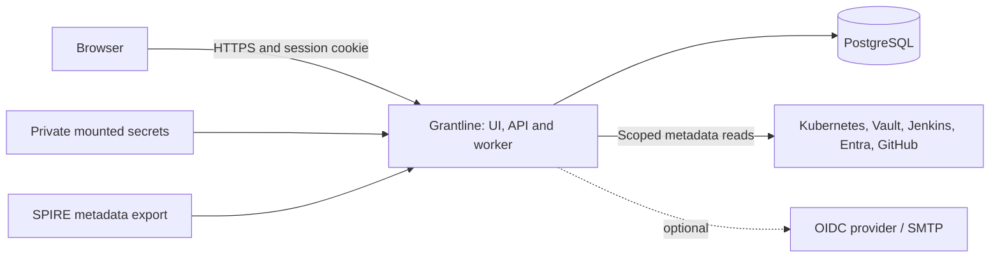

# Architecture

Grantline v0.1.0 is a self-hosted, single-organization application. One Go process
serves React, embedded documentation, the versioned HTTP API and one collection
worker. PostgreSQL is its only required service; Redis is not used.

## Collection and evidence

Administrators define connections, credentials, exact scope, policy and explicit
identity/environment bindings. Access testing and collection use the same scoped
collector paths. Each job receives its own credentials and creates a typed
snapshot, stable identity/relationship graph and policy report. Native IDs and
explicit declarations establish identity; matching display names is insufficient.

Reports record observation times, evidence IDs, completeness and provenance.
Provider observations, controlled exports, operator declarations and synthetic
fixtures remain distinguishable. Missing permissions or incomplete pagination do
not establish a clean source. Rules preserve PASS, FAIL, UNKNOWN and NOT_APPLICABLE;
review state is separate from those outcomes.

PostgreSQL stores users, server-side sessions, encrypted credentials, configuration
versions, durable jobs, immutable reports, review decisions and audit events.
Lists are paginated by the API. Report import creates a historical run, not a live
integration. Assignments, comments and risk acceptance persist independently of
snapshot retention.

## Trust boundaries

- The browser uses a server session cookie and CSRF checks. Roles are enforced in
  the API. Local privileged accounts require TOTP; OIDC uses explicit account
  linking and privileged-session MFA claims.
- Connector credentials are encrypted with an external master key or loaded from
  private files. See [metadata handling](./operations/metadata-handling).
- Collectors perform bounded metadata reads. They do not execute workflows,
  configure providers or expand permissions. Destination validation and TLS
  verification apply; operators should also restrict network egress.
- SPIRE administration stays outside the web server. An operator supplies an
  export; the server never mounts the administration socket.
- Containers use a non-root app, read-only root filesystem and temporary workspace.
  The app needs neither a Docker socket nor cluster API privileges for its own
  installation. Observing the hosting cluster requires a separate connection.

## Jobs and operations

One worker owns a PostgreSQL advisory lock. Jobs persist, support cancellation and
bounded retry, and recover interrupted work on restart. Manual and hourly scheduled
collection produce distinct runs. Readiness requires the expected schema and a
healthy worker; migrations precede startup.

Compose is the starting installation. Helm supports external PostgreSQL or an
optional evaluation database. Both use the same app image. One replica and Recreate
upgrades are intentional limits. Back up the database and matching encryption key
separately before upgrades.

There is no multi-tenant SaaS mode, horizontal scaling, HA database promise,
automatic provider remediation, comprehensive effective-access engine, secret
payload discovery or proof of every runtime identity relationship. Provider
fixtures and local labs do not replace customer acceptance.
See [verified compatibility](./reference/compatibility).
